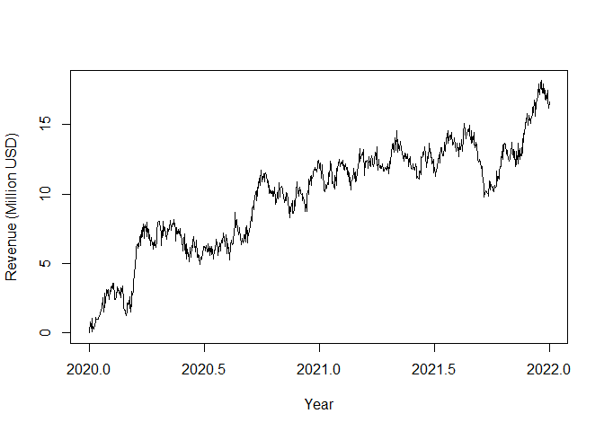
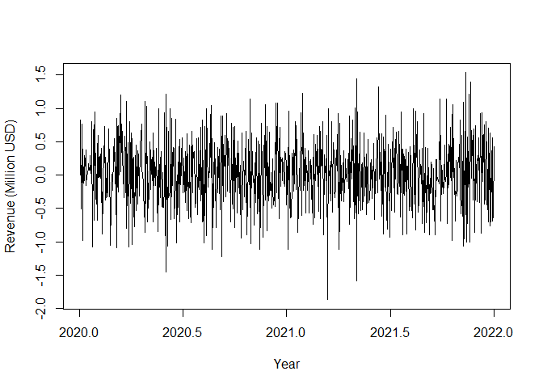
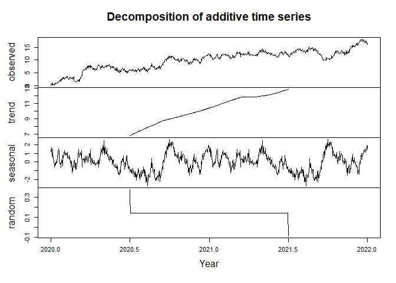
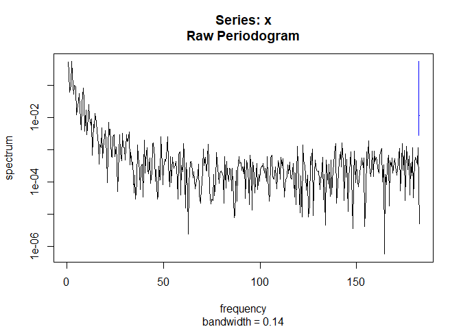
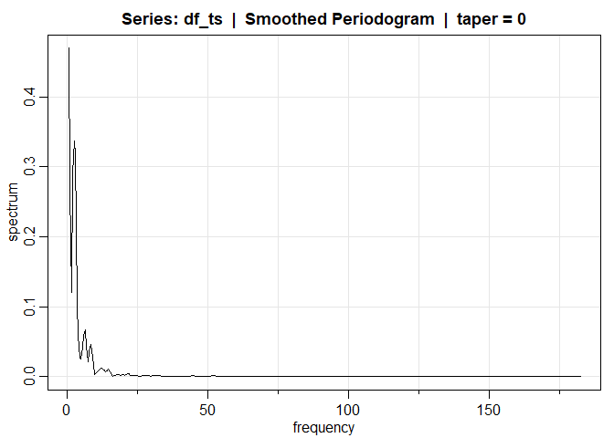
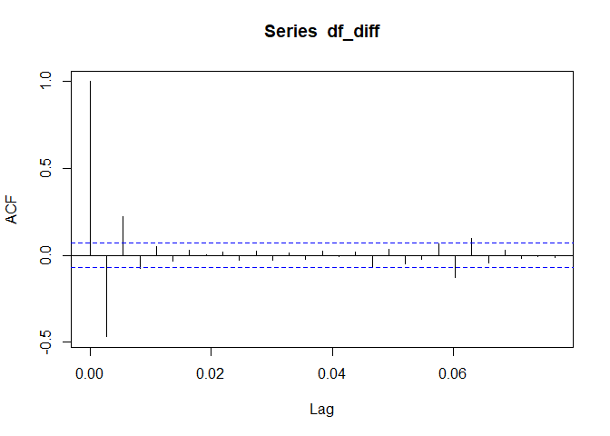
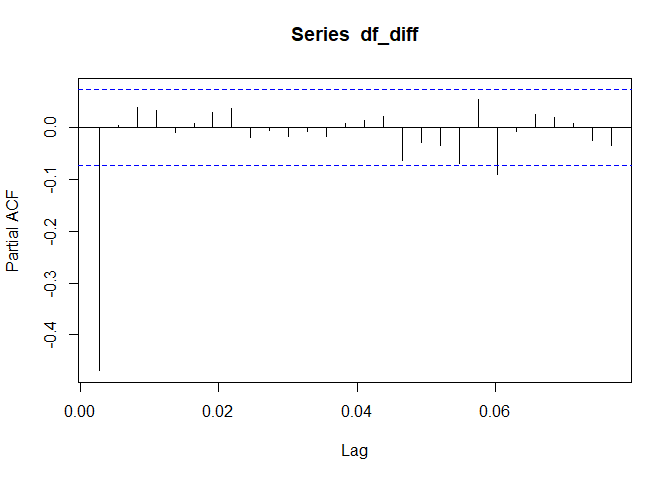
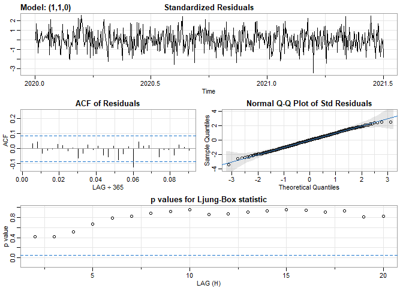
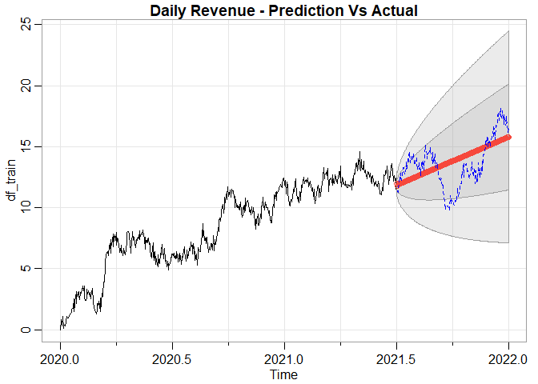

``` r
# Import libraries
library(tidyverse)
library(janitor)
library(astsa)
library(aTSA)
library(forecast)
library(MLmetrics)
```

``` r
# Read in data file
df <- read_csv(file="C:/Users/Josh/Data/School/time-series/data/teleco_time_series.csv")
df <- clean_names(df)

# Convert data to time series
df_ts <- ts(df$revenue, frequency = 365, start = 2020)
```

``` r
# Plot the revenue
ts.plot(df_ts, xlab = "Year", ylab = "Revenue (Million USD)")
```

<!-- -->

``` r
# Perform Augmented Dickey-Fuller test
adf.test(df_ts)
```

    ## Augmented Dickey-Fuller Test 
    ## alternative: stationary 
    ##  
    ## Type 1: no drift no trend 
    ##      lag   ADF p.value
    ## [1,]   0 0.219   0.707
    ## [2,]   1 1.065   0.922
    ## [3,]   2 1.050   0.920
    ## [4,]   3 0.960   0.909
    ## [5,]   4 0.894   0.900
    ## [6,]   5 0.902   0.901
    ## [7,]   6 0.879   0.897
    ## Type 2: with drift no trend 
    ##      lag   ADF p.value
    ## [1,]   0 -2.34   0.192
    ## [2,]   1 -1.92   0.358
    ## [3,]   2 -1.78   0.418
    ## [4,]   3 -1.83   0.395
    ## [5,]   4 -1.77   0.422
    ## [6,]   5 -1.90   0.368
    ## [7,]   6 -1.93   0.354
    ## Type 3: with drift and trend 
    ##      lag   ADF p.value
    ## [1,]   0 -4.82  0.0100
    ## [2,]   1 -3.25  0.0799
    ## [3,]   2 -3.13  0.0993
    ## [4,]   3 -3.28  0.0745
    ## [5,]   4 -3.30  0.0711
    ## [6,]   5 -3.42  0.0501
    ## [7,]   6 -3.49  0.0432
    ## ---- 
    ## Note: in fact, p.value = 0.01 means p.value <= 0.01

``` r
# Apply differencing to the data
df_diff <- diff(df_ts)

# And plot it
ts.plot(df_diff,  xlab = "Year", ylab = "Revenue (Million USD)")
```

<!-- -->

``` r
# Recheck the Augmented Dickey-Fuller test
adf.test(df_diff)
```

    ## Augmented Dickey-Fuller Test 
    ## alternative: stationary 
    ##  
    ## Type 1: no drift no trend 
    ##      lag    ADF p.value
    ## [1,]   0 -44.76    0.01
    ## [2,]   1 -22.90    0.01
    ## [3,]   2 -16.62    0.01
    ## [4,]   3 -13.65    0.01
    ## [5,]   4 -12.17    0.01
    ## [6,]   5 -10.93    0.01
    ## [7,]   6  -9.77    0.01
    ## Type 2: with drift no trend 
    ##      lag    ADF p.value
    ## [1,]   0 -44.87    0.01
    ## [2,]   1 -23.01    0.01
    ## [3,]   2 -16.73    0.01
    ## [4,]   3 -13.76    0.01
    ## [5,]   4 -12.31    0.01
    ## [6,]   5 -11.07    0.01
    ## [7,]   6  -9.91    0.01
    ## Type 3: with drift and trend 
    ##      lag    ADF p.value
    ## [1,]   0 -44.86    0.01
    ## [2,]   1 -23.00    0.01
    ## [3,]   2 -16.73    0.01
    ## [4,]   3 -13.76    0.01
    ## [5,]   4 -12.31    0.01
    ## [6,]   5 -11.08    0.01
    ## [7,]   6  -9.92    0.01
    ## ---- 
    ## Note: in fact, p.value = 0.01 means p.value <= 0.01

``` r
# Create train/test splits
df_train <- head(df_ts, round(length(df_diff)*.75))
df_test <- tail(df_ts, round(length(df_diff)*.25))
```

``` r
# And write them to new files
write.csv(df_train, "C:/Users/Josh/Data/School/time-series/data/teleco_train.csv")
write.csv(df_test, "C:/Users/Josh/Data/School/time-series/data/teleco_test.csv")
```

``` r
# Decompose the time series data into components
df_comps <- decompose(df_ts)
plot(df_comps, xlab = "Year")
```

<!-- -->

``` r
# Plot periodogram
spectrum(df_ts)
```

<!-- -->

``` r
# Plot smoothed periodogram
kern <- kernel("daniell", 1)
mvspec(df_ts, kern, log = "n")
```

<!-- -->

``` r
# Plot ACF
acf(df_diff)
```

<!-- -->

``` r
# Plot PACF
pacf(df_diff)
```

<!-- -->

``` r
# Finding best model parameters
auto.arima(df_train, trace=TRUE)
```

    ## 
    ##  Fitting models using approximations to speed things up...
    ## 
    ##  ARIMA(2,1,2)             with drift         : 735.5491
    ##  ARIMA(0,1,0)             with drift         : 864.6843
    ##  ARIMA(1,1,0)             with drift         : 733.1027
    ##  ARIMA(0,1,1)             with drift         : 759.36
    ##  ARIMA(0,1,0)                                : 863.5314
    ##  ARIMA(2,1,0)             with drift         : 733.2437
    ##  ARIMA(1,1,1)             with drift         : 735.1141
    ##  ARIMA(2,1,1)             with drift         : 733.8414
    ##  ARIMA(1,1,0)                                : 733.5782
    ## 
    ##  Now re-fitting the best model(s) without approximations...
    ## 
    ##  ARIMA(1,1,0)             with drift         : 731.0853
    ## 
    ##  Best model: ARIMA(1,1,0)             with drift

    ## Series: df_train 
    ## ARIMA(1,1,0) with drift 
    ## 
    ## Coefficients:
    ##           ar1   drift
    ##       -0.4676  0.0216
    ## s.e.   0.0379  0.0137
    ## 
    ## sigma^2 = 0.2211:  log likelihood = -362.52
    ## AIC=731.04   AICc=731.09   BIC=743.95

``` r
# Building the model
model <- sarima(df_train, p=1, d=1, q=0)
```

    ## initial  value -0.632470 
    ## iter   2 value -0.755501
    ## iter   3 value -0.755507
    ## iter   4 value -0.755508
    ## iter   5 value -0.755508
    ## iter   5 value -0.755508
    ## iter   5 value -0.755508
    ## final  value -0.755508 
    ## converged
    ## initial  value -0.756195 
    ## iter   2 value -0.756195
    ## iter   3 value -0.756195
    ## iter   3 value -0.756195
    ## iter   3 value -0.756195
    ## final  value -0.756195 
    ## converged

<!-- -->

``` r
model
```

    ## $fit
    ## 
    ## Call:
    ## arima(x = xdata, order = c(p, d, q), seasonal = list(order = c(P, D, Q), period = S), 
    ##     xreg = constant, transform.pars = trans, fixed = fixed, optim.control = list(trace = trc, 
    ##         REPORT = 1, reltol = tol))
    ## 
    ## Coefficients:
    ##           ar1  constant
    ##       -0.4676    0.0216
    ## s.e.   0.0379    0.0137
    ## 
    ## sigma^2 estimated as 0.2203:  log likelihood = -362.52,  aic = 731.04
    ## 
    ## $degrees_of_freedom
    ## [1] 545
    ## 
    ## $ttable
    ##          Estimate     SE  t.value p.value
    ## ar1       -0.4676 0.0379 -12.3428  0.0000
    ## constant   0.0216 0.0137   1.5822  0.1142
    ## 
    ## $AIC
    ## [1] 1.336455
    ## 
    ## $AICc
    ## [1] 1.336496
    ## 
    ## $BIC
    ## [1] 1.360063

``` r
# Plotting prediction vs. actual
df_pred <- sarima.for(df_train, n.ahead=183, p=1, d=1, q=0, plot.all=TRUE)
abline(v = ts(c(548)), col = "brown", lty = 2)
points(df_test, type = "l", col = "blue" , lty = 2)
title(main="Daily Revenue - Prediction Vs Actual")
```

<!-- -->

``` r
# Forecasting and accuracy
forecast <- forecast(df_train, model=auto.arima(df_train), h=length(df_test))
accuracy(forecast, df_test)
```

    ##                         ME      RMSE       MAE       MPE     MAPE       MASE
    ## Training set -1.337493e-05 0.4689149 0.3758748      -Inf      Inf 0.05194607
    ## Test set     -2.708489e-01 1.7850737 1.5052124 -3.713642 11.92844 0.20802105
    ##                     ACF1 Theil's U
    ## Training set 0.002044571        NA
    ## Test set     0.951253164  3.641878
